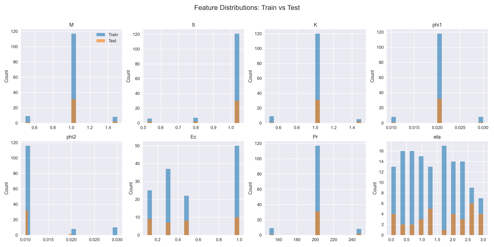
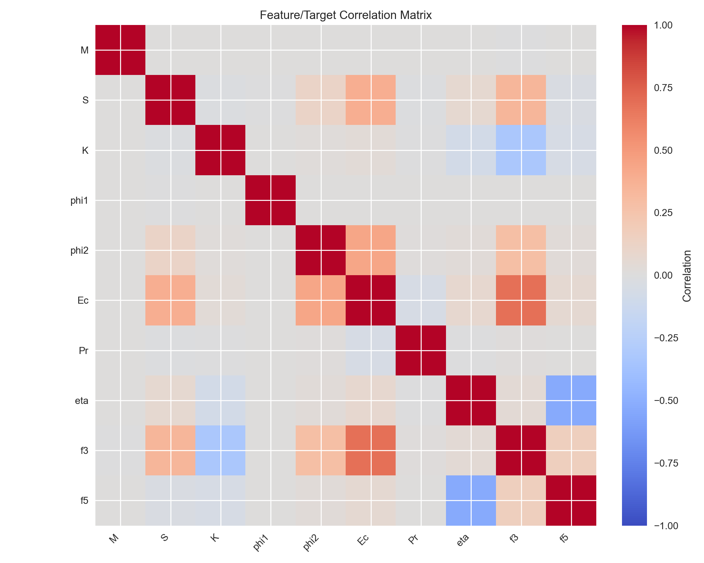
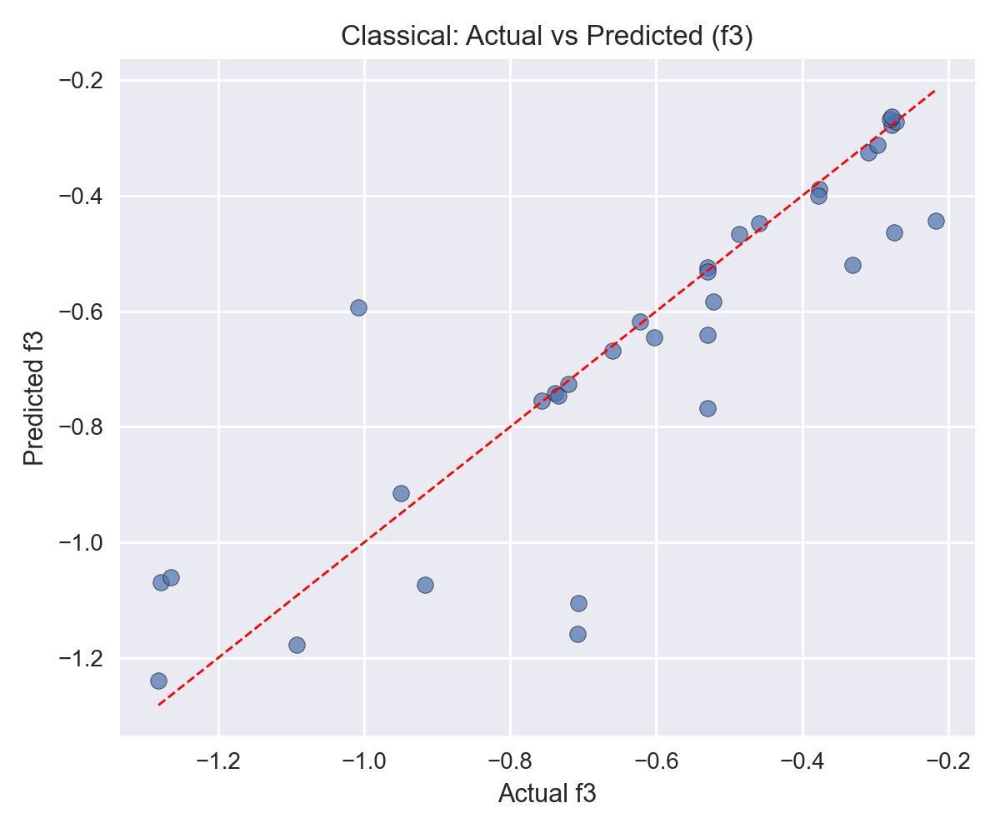
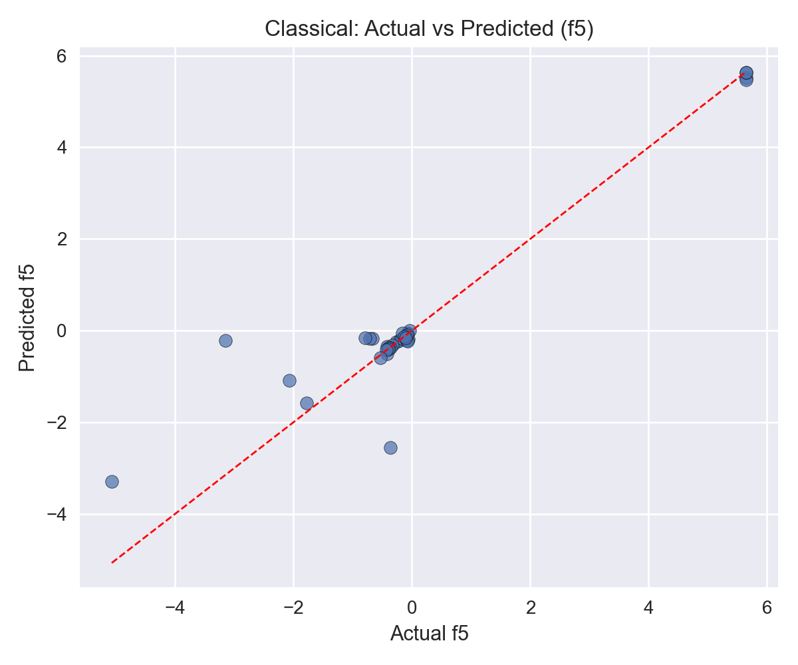
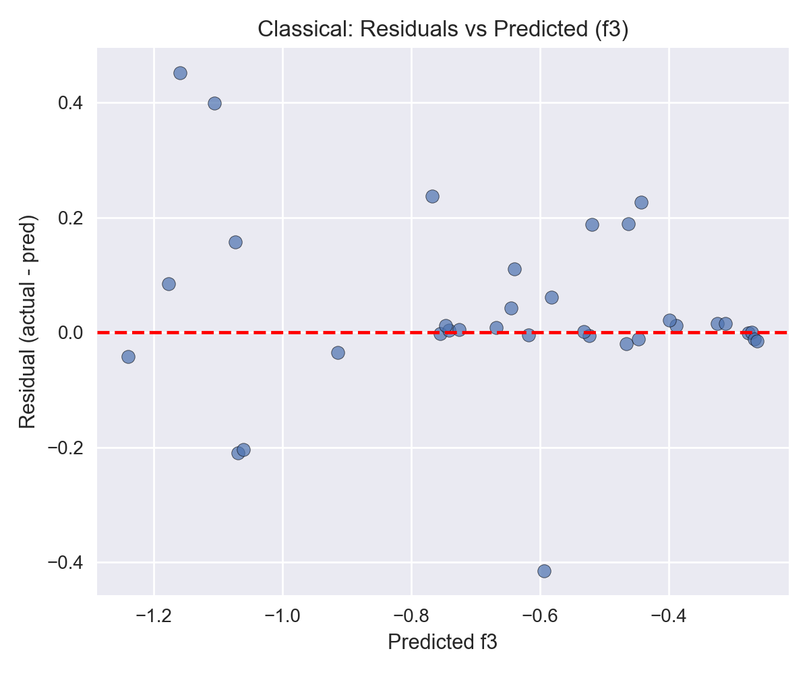
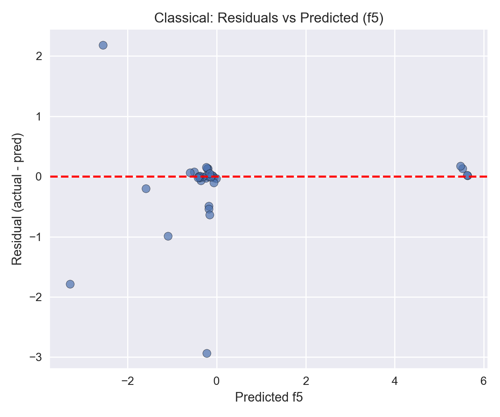
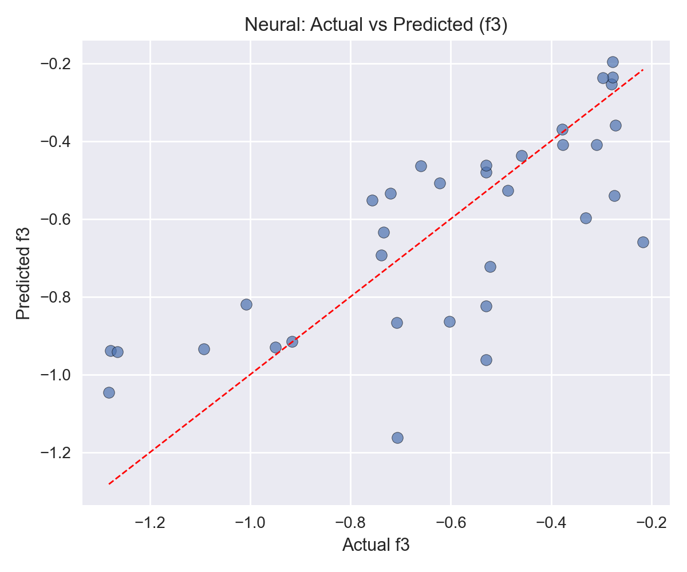
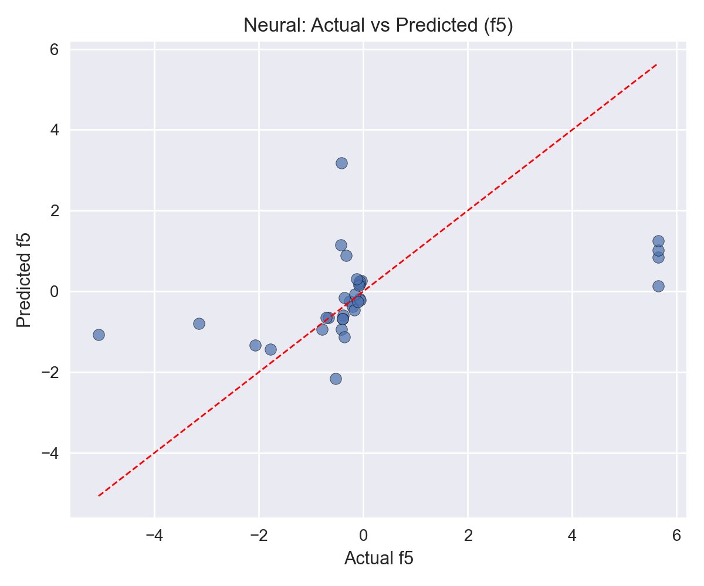
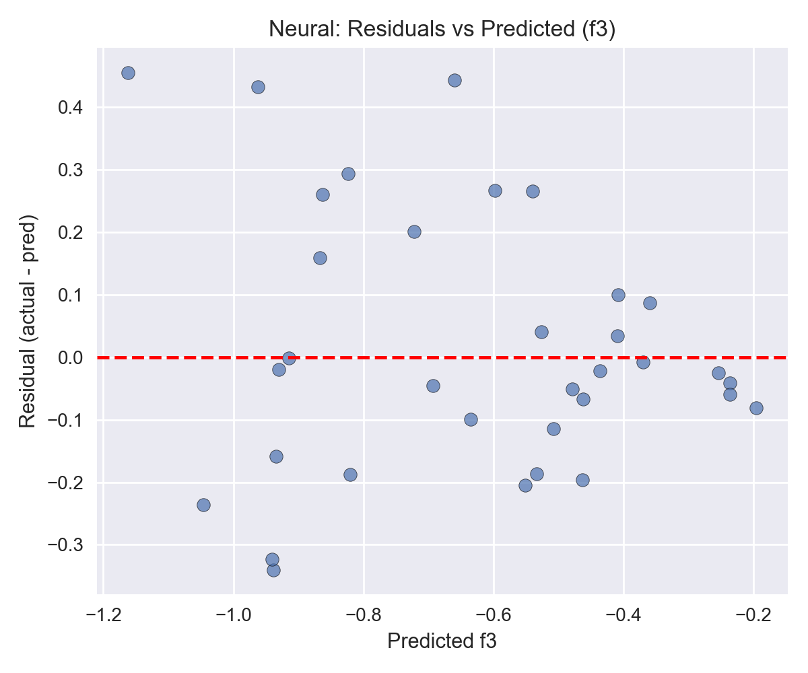
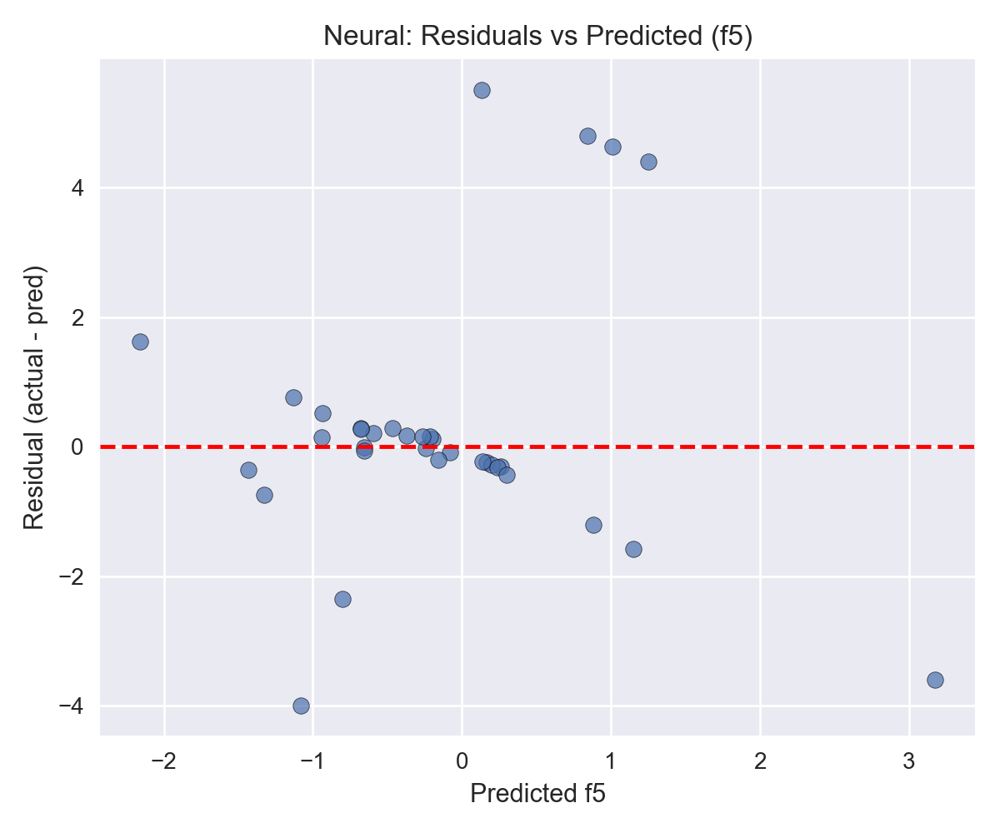

# Hybrid Nanofluid ML Project – Technical Report

Date: 2025-11-14

## 1. Project overview

- **Objective**: Learn surrogate models that predict the velocity and temperature gradients of a hybrid nanofluid boundary layer, i.e.
  - `f3(η) = f''(η)` (momentum/velocity gradient)
  - `f5(η) = θ'(η)` (thermal gradient)
- **Ground truth**: MATLAB RK4 + shooting solver snapshots stored in `survey_sample_data.xlsx`.
- **Scope**: Clean the solver data according to the agent’s First Principles Framework (FPF), train classical ML and neural models, evaluate them rigorously, and analyze diagnostics/residuals to ensure physical fidelity.

## 2. Data preparation

- The Excel payload is parsed manually (no external dependencies) via `preprocess.py`.
- **Mandatory cleaning rules (see `AGENT.md`)**:
  1. Drop rows with missing `f3` or `f5`.
  2. Remove numerical blow-ups (`|f3|` or `|f5| > 1e4`).
  3. Convert rotation parameter `S` from degrees to radians whenever `S > 3.5`.
  4. Enforce `0 ≤ η ≤ 5`.
  5. Restore canonical column ordering `[M, S, K, phi1, phi2, Ec, Pr, eta, f3, f5]`.
  6. Persist the cleaned master dataset (`clean_dataset.csv`) and stratified train/test splits in `data/processed/`.

## 3. Exploratory visualizations

### 3.1 Feature distributions

- Training and test sets exhibit similar distributions for most features; mild shifts exist for `phi2` (slightly lower on the test split) and `eta` (test data extends further).

### 3.2 Correlation structure

- Magnetic (`M`) and permeability (`K`) parameters are moderately correlated.
- `η` drives both gradients strongly, while `S` mainly affects `f3` via the rotation term.

## 4. Modeling summary

### 4.1 Classical ensemble (XGBoost pipeline – `models/classical_baseline.pkl`)

Test-set metrics (see `reports/verification_summary.json`):

| Metric | f3 | f5 | Joint |
| --- | --- | --- | --- |
| MAE | 0.0947 | 0.3255 | 0.2101 |
| RMSE | 0.1585 | 0.7403 | 0.5353 |
| R² | 0.7308 | 0.8930 | — |

- Trained with StandardScaler + `MultiOutputRegressor(XGBRegressor)` (600 trees, depth 5, hist tree method).
- 5-fold CV: MAE ≈ 0.14 ± 0.06, RMSE ≈ 0.43 ± 0.20, R²(f3) ≈ 0.82 ± 0.09, R²(f5) ≈ 0.88 ± 0.12 (see `reports/cross_validation_summary.png`).

### 4.2 Neural network (64→128→64→2)

- Architecture per spec, trained with Adam, MSE loss, patience 40.
- Test metrics:

| Metric | f3 | f5 | Joint |
| --- | --- | --- | --- |
| MAE | 0.1620 | 1.1795 | 0.6707 |
| RMSE | 0.2080 | 2.0146 | 1.4321 |
| R² | 0.5367 | 0.2074 | — |

- Performs worse than the XGBoost pipeline, especially on the thermal gradient.

## 5. Diagnostic plots

### 5.1 Classical model

 

 

- `f3` residuals cluster tightly around zero with no clear bias.
- `f5` residuals show a mild positive trend, indicating systematic error at higher predicted values—a cue to gather more data where `η` is large or `phi2` is small.

### 5.2 Neural model

 

 

- Residuals are larger and more structured, consistent with the poorer scalar metrics.

## 6. Verification highlights

- `reports/verification_summary.json` confirms:
  - **No data leakage** (`leakage_count = 0`).
  - All `S` values are in radians (range `[0.524, 1.047]`).
  - Max absolute target magnitude ≤ 5.65 (far from the rejection threshold).
- Train/test distribution comparison flags two shifts (`phi2`, `eta`), explaining the slightly weaker `f5` generalization.

## 7. Conclusions & next steps

1. **Best current model**: XGBoost ensemble (joint RMSE ≈ 0.54, `R²_f5 ≈ 0.89`).
2. **Neural baseline** requires additional data or regularization to match ensemble performance.
3. **Recommended actions**:
   - Extend the solver dataset for higher `η` values and lower `phi2` to reduce the observed domain shift and residual trends.
   - Experiment with physics-informed losses or feature engineering (e.g., explicit `η` interactions) to reduce the `f5` bias.
   - Continue monitoring parity/residual plots after each retrain to maintain compliance with the FPF rules.
